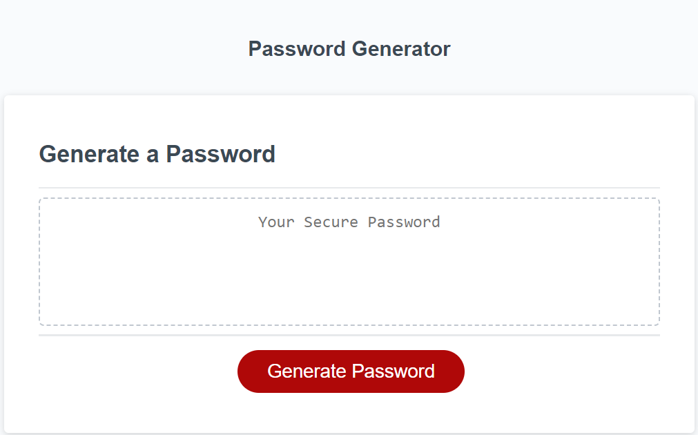

# Random Password Generator

## Description
The motivation for this project was to create an application using JavaScript that would enable the user to generate a random password customized to that user's individual inputs.
The goal of the project was for the application to be accesible via a button element and prompt the user to enter a password length 8-128 characters and have the user decide whether or not to include Lowercase, Uppercase, Number, and Special characters in their random password.
The final application also contains error handling that provides the user with alerts if they have entered an incompatable value for password length or not selected at least one type of character to include in the random password.
Through completing this application I was able to better learn how to utilize arrays, JavaScript functions, and user prompts.

## Screenshot

## Link to Deployed Site
https://mdlahey1.github.io/matthew-lahey-password-generator/

## Link to GitHub Repository
https://github.com/mdlahey1/matthew-lahey-password-generator

